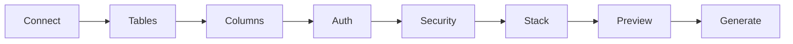
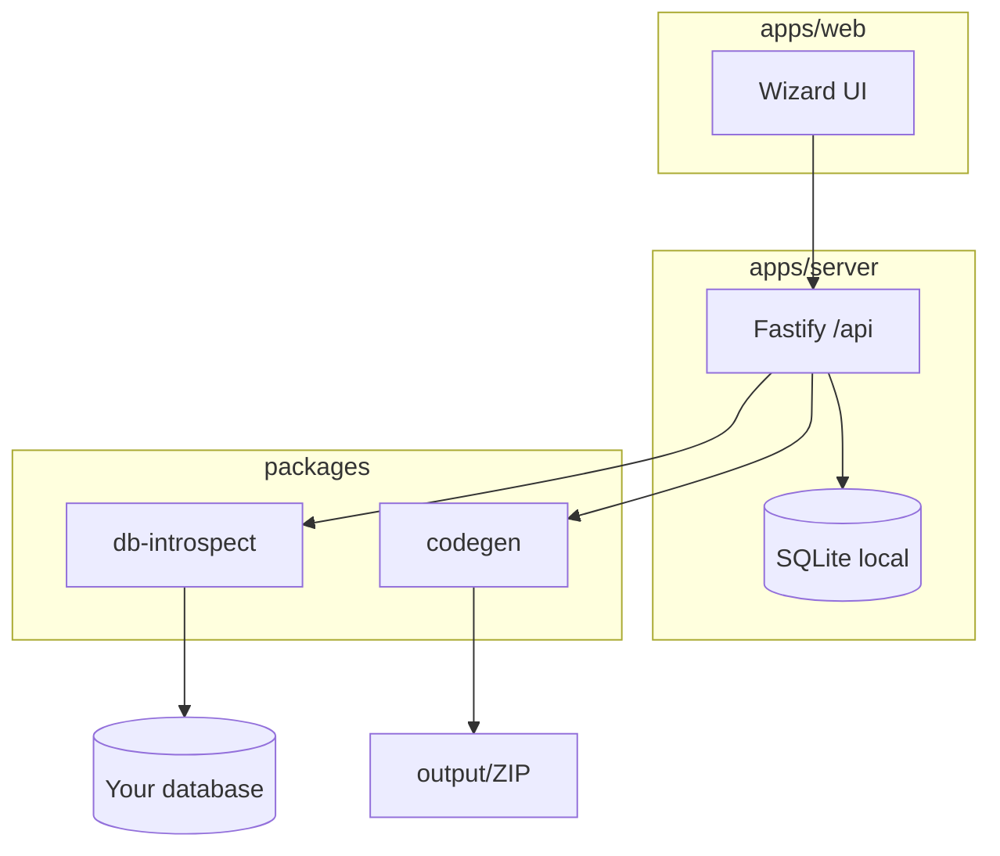

# ApiForge

**Forge production-ready APIs from your database — entirely on your machine.**

[](LICENSE)
[](https://nodejs.org/)
[](https://www.typescriptlang.org/)
[](#)

No cloud account. No login wall. Connect a database, pick tables and columns, configure JWT + CORS + rate limits, choose a stack, and download a runnable API with Swagger.

```
DB  ──►  ApiForge Wizard  ──►  .NET Minimal / Web API / Express / Fastify
```

## Why ApiForge

Most API generators dump boilerplate and leave security as an afterthought. ApiForge is built for the last mile:

- **Local-first** — SQLite store on disk; connection secrets encrypted with AES-256-GCM
- **Multi-engine** — PostgreSQL, MySQL, SQL Server, SQLite
- **Four stacks** — .NET 8 Minimal API, .NET Web API Controllers, Express, Fastify
- **Auth that thinks** — detects `username`/`login` + `password` tables, or generates a `users` table + JWT endpoints
- **Security knobs** — CORS (all / origins), IP allowlist, rate limit, optional API key, Helmet
- **Swagger by default** — OpenAPI UI in every generated project
- **Preview before forge** — file tree + endpoint map before you download the ZIP

## Quick start

```bash
git clone https://github.com/YOUR_USERNAME/apiforge.git
cd apiforge
npm install
npm run dev
```

Open **http://localhost:5173** — the wizard UI.  
API server runs on **http://localhost:8787**.

| Script | What it does |
|--------|----------------|
| `npm run dev` | Server + web (concurrent) |
| `npm run build` | Build all workspaces |
| `npm run typecheck` | TypeScript across the monorepo |

## Wizard flow



1. **Connect** — pick engine + credentials (or SQLite file)
2. **Tables** — multi-select what to expose
3. **Columns** — include/exclude, mark sensitive fields
4. **Auth** — use detected login table, create `users`, or skip
5. **Security** — CORS, IPs, rate limit, API key
6. **Stack** — Minimal / Web API / Express / Fastify
7. **Preview** — inspect generated files & endpoints
8. **Generate** — ZIP download + copy under `./output/<project>`

## Architecture

```
apiforge/
  apps/
    web/              React 19 + Vite + Tailwind (wizard UI)
    server/           Fastify tool API + local SQLite
  packages/
    shared/           Shared TypeScript types
    db-introspect/    Schema introspection + auth detection
    codegen/          Generators for all four stacks
  examples/
    demo-api/         Sample generated Express API
  output/             Your forged projects land here
```



## Generated API includes

For each selected table:

| Method | Path | Description |
|--------|------|-------------|
| `GET` | `/api/{resources}` | List (optional pagination) |
| `GET` | `/api/{resources}/:id` | Get by primary key |
| `POST` | `/api/{resources}` | Create |
| `PUT` | `/api/{resources}/:id` | Update |
| `DELETE` | `/api/{resources}/:id` | Delete |

Plus when auth is enabled: `POST /auth/login`, optional `POST /auth/register`, JWT Bearer on CRUD routes.

## Example (demo)

See [`examples/demo-api`](examples/demo-api) — a forged Express sample with products CRUD, JWT, rate limit, and Swagger at `/api-docs`.

```bash
cd examples/demo-api
cp .env.example .env
npm install
npm run dev
```

## Privacy

ApiForge never phones home. Introspection and generation run on `localhost`. Saved connection configs are encrypted at rest in `apps/server/data/`.

## Tech stack

- **UI:** React 19, Vite, Tailwind, Framer Motion
- **Tool API:** Fastify, better-sqlite3, archiver
- **Codegen:** TypeScript programmatic templates (.NET 8 + Node)
- **Drivers:** `pg`, `mysql2`, `mssql`, `better-sqlite3`

## Contributing

See [CONTRIBUTING.md](CONTRIBUTING.md). PRs welcome — especially new stack templates and DB engines.

## License

[MIT](LICENSE) — build something people will star.

---

**Ship it.** Connect a DB, forge an API, post the repo on LinkedIn.
