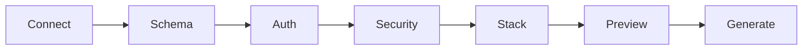
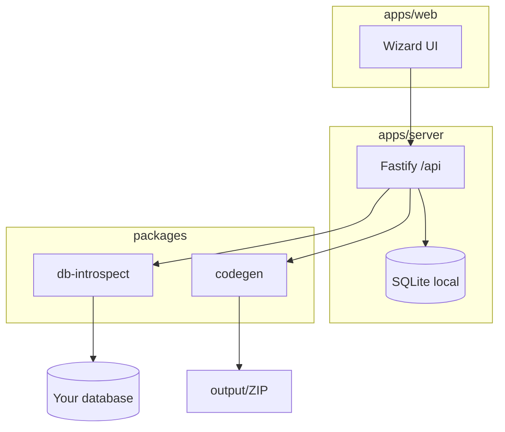

# ApiForge

**Forge production-ready APIs from your database — entirely on your machine.**

[](LICENSE)
[](https://nodejs.org/)
[](https://www.typescriptlang.org/)
[](#)

No cloud account. No login wall. Connect a database, design the schema on a canvas, configure JWT + CORS + rate limits, choose a stack, and download a runnable API with Swagger.

```
DB  ──►  ApiForge Wizard  ──►  .NET Minimal / Web API / Express / Fastify
```

## Why ApiForge

Most API generators dump boilerplate and leave security as an afterthought. ApiForge is built for the last mile:

- **Local-first** — SQLite store on disk; connection secrets encrypted with AES-256-GCM
- **Multi-engine** — PostgreSQL, MySQL, SQL Server, SQLite
- **Four stacks** — .NET 10 Minimal API, .NET Web API Controllers, Express 5, Fastify 5
- **Schema canvas** — drag tables, pick columns, toggle CRUD operations per table
- **Auth that thinks** — detects `username`/`login` + `password` tables, or generates a `users` table + JWT endpoints
- **Security knobs** — CORS (all / origins), IP allowlist, rate limit, optional API key, Helmet
- **Swagger by default** — OpenAPI UI in every generated project
- **Preview before forge** — file tree + endpoint map before you download the ZIP
- **E2E matrix** — generate + full CRUD proven across all stacks and engines (CI + local)

## Quick start

```bash
git clone https://github.com/andersondfm/apiforge.git
cd apiforge
npm install
npm run dev
```

Open **http://localhost:5173** — the wizard UI.  
API server runs on **http://localhost:8787**.

| Script | What it does |
|--------|----------------|
| `npm run dev` | Server + web (concurrent) |
| `npm run build` | Build all workspaces |
| `npm run typecheck` | TypeScript across the monorepo |
| `npm run ensure:dbs` | Start/reuse Docker test DBs (MySQL, Postgres, SQL Server) |
| `npm run test:e2e` | Generate × install × CRUD matrix (16 cells) |

## Wizard flow



1. **Connect** — pick engine + credentials (or SQLite file)
2. **Schema** — canvas: drag tables, columns, CRUD operations (list/get/create/update/delete)
3. **Auth** — use detected login table, create `users`, or skip
4. **Security** — CORS, IPs, rate limit, API key
5. **Stack** — Minimal / Web API / Express / Fastify
6. **Preview** — inspect generated files & endpoints
7. **Generate** — ZIP download + copy under `./output/<project>`

## Architecture

```
apiforge/
  apps/
    web/              React 19 + Vite + Tailwind (wizard UI)
    server/           Fastify tool API + local SQLite
  packages/
    shared/           Shared TypeScript types
    db-introspect/    Schema introspection + auth detection
    codegen/          Generators for all four stacks
  scripts/
    mysql|postgres|sqlserver/   Docker compose + seed (demo/demo)
    sqlite/seed.sql             File DB seed for E2E
    ensure-dbs.mjs              Reuse healthy containers
    e2e/                        Generate + CRUD harness
  examples/
    demo-api/         Sample generated Express API
  output/             Your forged projects land here
```



## Generated API includes

For each selected table (routes use the table name, e.g. `/products`):

| Method | Path | Description |
|--------|------|-------------|
| `GET` | `/{resources}` | List (optional pagination) |
| `GET` | `/{resources}/:id` | Get by primary key |
| `POST` | `/{resources}` | Create |
| `PUT` | `/{resources}/:id` | Update |
| `DELETE` | `/{resources}/:id` | Delete |

Plus when auth is enabled: `POST /auth/login`, optional `POST /auth/register`, JWT Bearer on CRUD routes.

## Local test databases & E2E

Docker Desktop is required for MySQL / PostgreSQL / SQL Server. SQLite uses a temp file (no container).

| Engine | Container | Port | Credentials |
|--------|-----------|------|-------------|
| MySQL | `apiforge-mysql` | 3306 | `demo` / `demo` / db `demo` |
| PostgreSQL | `apiforge-postgres` | 5432 | `demo` / `demo` / db `demo` |
| SQL Server | `apiforge-mssql` | 1433 | `sa` / `Your_strong_Password123` / db `demo` |
| SQLite | — | — | path from harness |

Seed tables: `products` (Widget, Gadget) and `users` (demo / password).

```bash
# Bring up DBs (skips containers that are already healthy)
npm run ensure:dbs

# Full matrix: 4 stacks × 4 engines → generate, install, start, CRUD /products
npm run build
npm run test:e2e
```

Filters:

```bash
# Node only
E2E_SKIP_DOTNET=1 npm run test:e2e

# One cell
E2E_STACKS=node-express E2E_ENGINES=mysql npm run test:e2e
```

CI runs the same matrix on every PR (Node 22 + .NET 10 + Docker). Details: [`scripts/README.md`](scripts/README.md).

**Requirements for E2E:** Docker Desktop, Node 22+ (for `node:sqlite`), .NET 10 SDK (for Minimal / Web API stacks).

## Example (demo)

See [`examples/demo-api`](examples/demo-api) — a forged Express sample with products CRUD, JWT, rate limit, and Swagger at `/api-docs`.

```bash
cd examples/demo-api
cp .env.example .env
npm install
npm run dev
```

## Privacy

ApiForge never phones home. Introspection and generation run on `localhost`. Saved connection configs are encrypted at rest in `apps/server/data/`.

## Tech stack

- **UI:** React 19, Vite, Tailwind, Framer Motion, React Flow (schema canvas)
- **Tool API:** Fastify, better-sqlite3, archiver
- **Codegen:** TypeScript programmatic templates (.NET 10 + Node)
- **Drivers:** `pg`, `mysql2`, `mssql`, `better-sqlite3`
- **E2E:** `scripts/e2e` harness + Docker seeds (no Jest/Vitest required)

## Contributing

See [CONTRIBUTING.md](CONTRIBUTING.md). PRs welcome — especially new stack templates and DB engines. Run `npm run typecheck` and, when changing codegen, `npm run test:e2e` before opening a PR.

## License

[MIT](LICENSE) — build something people will star.

---

**Ship it.** Connect a DB, forge an API, post the repo on LinkedIn.
